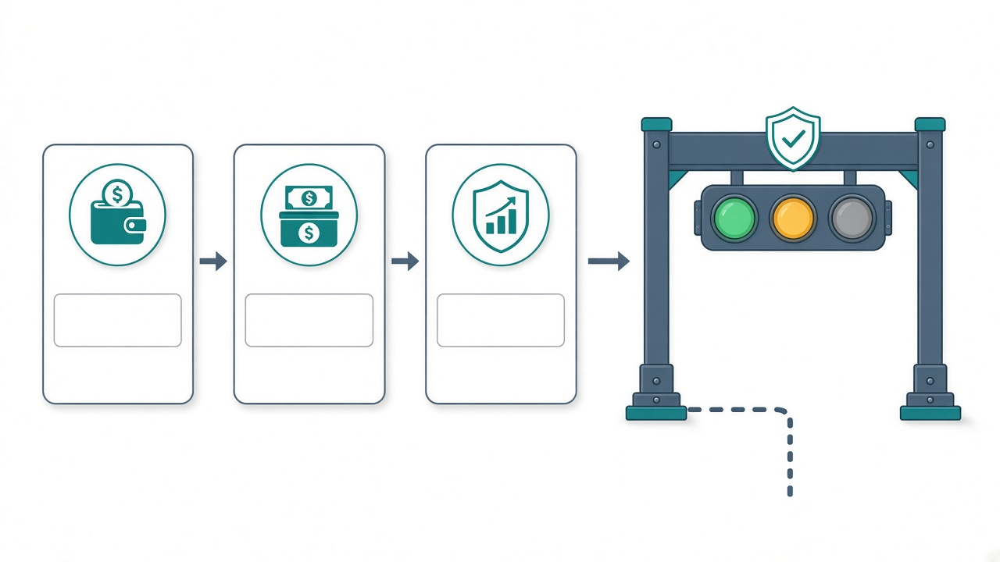

# 公众号稿 · 可直接发

**封面：** `images/fw-cover-16x9-cn-title.png`  
**插图：** 安装 → 出手前先问 → 监控竖图  
**摘要：** 开源 Skill：先问哪笔钱，再谈家底和 A 股盯盘。教你怎么装、怎么跟 AI 说话。不荐股。

**标题选一：**
1. 我给 AI 装了一套「先问哪笔钱」的技能  
2. 家庭理财别急着让 AI 荐股：先装这个开源 Skill  
3. 一条命令：Cursor / Claude 也能按你家规矩办事

---

## 正文

用 AI 管钱，我踩过的坑大概就两类：

- 它很会说「可以买」，但不知道这是保本的钱还是自己炒股的钱  
- 提示词越写越长，日报还是得自己翻行情网站  

后来我想：与其每次从零叮嘱，不如把规矩做成 **Skill**——装一次，每轮对话自动带着走。

于是有了开源包 **Family Wealth Skills**：  
https://github.com/OsbornWJ/family-wealth-skills

---

### 它到底是啥

一句话：**教 AI 按你的家庭约定办事**，顺便带上 A 股早盘/尾盘/日报脚本。

你得到：

- 出手前先问：哪笔钱、应急金、股票会不会买太多  
- 家底表：本地记，对话里用表格看  
- 盯盘脚本：一条 Python 命令跑完  

你得不到（也别指望）：

- 今日金股、保证收益、代客下单  
- 漂亮的网页看板（故意不做）  
- 美股券商一键交易  


### 怎么装（真的就一条）

电脑终端里：

```bash
curl -fsSL https://raw.githubusercontent.com/OsbornWJ/family-wealth-skills/main/install.sh | bash
```

要跑监控再装依赖：

```bash
pip3 install requests pandas akshare baostock
```

填砸了、想卸掉，仓库 README 里还有重置和卸载——也是一条命令。

**装完请新开一轮 AI 对话**，不然旧聊天可能还没加载到技能。

### 数字放哪

有空再填，不填也能先体验示例：

- 月支出、配比 → `ips.local.md`  
- 家底 → `balance-sheet.local.md`  
- 监控列表 → `portfolio.local.json`  

都在本机 `~/.family-wealth-skills/` 下。  
**别发到群里，别推进公开 GitHub。**



### 跟 AI 说话可以这样抄

1. 「按 family-wealth-ips：先问清楚哪笔钱、应急金、股票类占比」  
2. 「根据家底表算一下净资产和大概结构」  
3. 需要停靠现金、收息流程、或跑日报时，再点名对应 Skill  

它若回「先别买」，就不该再甩一串加仓代码——那是规矩，不是客套。

跑个日报试试：

```bash
cd ~/.family-wealth-skills/a-share-daily-monitor
python3 scripts/daily_monitor.py
```


### 适合谁

- 主要玩 A 股 / 场内 ETF / 人民币固收  
- 已经在用 Cursor、Claude 这类工具  
- 想要约定和脚本，而不是又一个「今日必涨」账号  

### 免责

不构成投资建议。数据可能延迟或失败。买不买，决定权在你。

想到就装，别拖——拖延症我是懂的。
